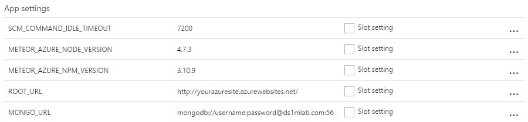

# meteor-azure

Automate Meteor deployments on **Azure App Service** for **Meteor 1.4+**

## Prerequisites

Meteor 1.4+

## Setup Azure App Service
You require an App Service on **Basic plan or higher.** 


### General Settings
* Web Sockets: On
* ARR Affinity: On


### App Settings




Delete any existing App settings and set the following settings:

* SCM_COMMAND_IDLE_TIMEOUT: 7200
* METEOR_AZURE_NODE_VERSION:

Node version bundled with your current Meteor release
 go to your app directory and run:  

    meteor node --version
    
* METEOR_AZURE_NPM_VERSION:

NPM version bundled with your current Meteor release
      go to your app directory and run: 
 
     meteor npm --version
* ROOT_URL: http://{sitename}.azurewebsites.net or a custom domain you've set up
* MONGO_URL MongoDB connection string
* MONGO_OPLOG_URL - Optional: Recommended with multiple instances
* METEOR_SETTINGS - Optional: e.g from your settings.json
* METEOR_AZURE_ROOT - Optional: Path to your .meteor directory **IF** it's nested (e. g. src\\)
* METEOR_AZURE_NOCACHE - Optional: Set any value to enable (significantly slows down build)


## Setup Repository instructions

1. Copy the **contents** of the ```script``` directory into the top-level of your repository, so that your directory will look like:


```shell
.config/
imports/
client/
server/
.deployment
```
  
   
You can also put your Meteor Files into a subdirectory like in the example repository. If you do so you need to set METEOR_AZURE_ROOT in your App Settings

2. Configure a deployment source in the Azure portal ([detailed instructions](https://azure.microsoft.com/en-us/documentation/articles/app-service-continuous-deployment)) 

## Force HTTPS

Meteor's core [force-ssl](https://atmospherejs.com/meteor/force-ssl) package is incompatible with our setup. You can achieve the same functionality with an extra rewrite rule in your web.config (see a full example [here](https://raw.githubusercontent.com/talos-code/meteor-azure-example/master/.config/azure/web.config)):

```xml
<!-- Force HTTPS -->
<rule name="Redirect to HTTPS" stopProcessing="true">
  <match url="(.*)" />
  <conditions>
    <add input="{HTTPS}" pattern="^OFF$" />
  </conditions>
   <action type="Redirect" url="https://{HTTP_HOST}/{R:1}" redirectType="Permanent" />
</rule>
```

Note that with this approach ROOT_URL should be prefixed with 'https' (if not already)

## Example

See the [meteor-azure-example](https://github.com/talos-code/meteor-azure-example) repository


