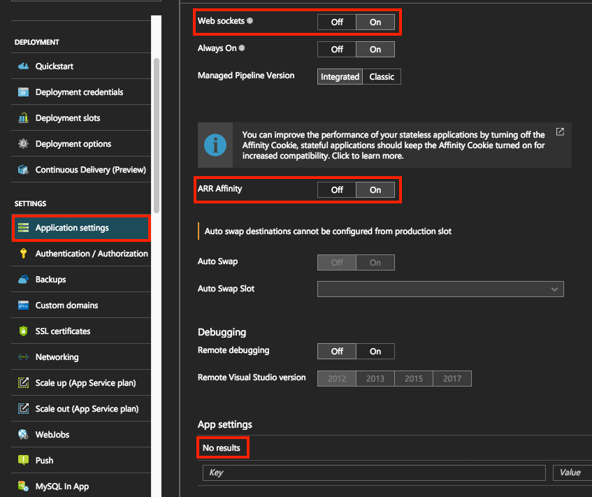
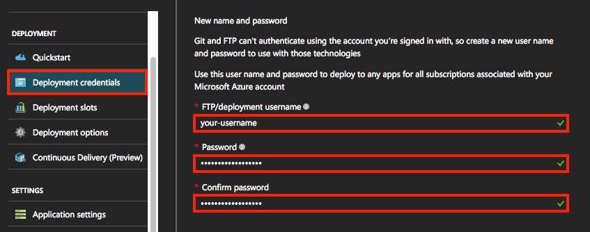
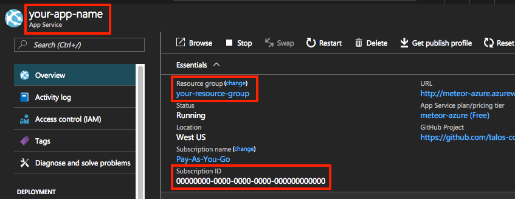
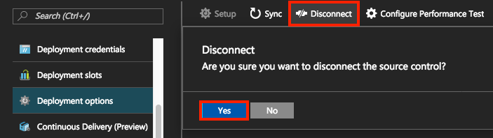
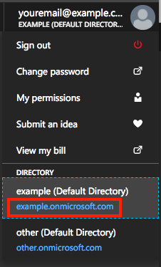

===============
Getting started
===============

Once you've :doc:`installed <installation>` Meteor Azure on your machine, this tutorial will run you
through the basic setup and configuration of a new project.

Step 1: Create Azure Web App
============================

If you don't already have a Web App in Azure, you can create one using the portal:

.. raw:: html

    

        <iframe src='https://www.youtube.com/embed//yL_CWzD5pLI' frameborder='0' allowfullscreen></iframe>
    

|

.. note:: We do not support the Linux preview

Step 2: Configure Azure Web App
===============================

In the portal, navigate to your Web App and open "Application Settings".

Ensure "Web sockets" and "ARR affinity" are enabled under "General Settings", then
clear any existing entries under "App settings":

Open "Deployment credentials" and set a username and password (these are applicable to any app in your account):

Next, open "Overview" and record your app name, resource group and subscription ID:

If you have previously configured a deployment source for your app, open "Deployment options" and disconnect:

Activate the user drop-down and take note of the domain which appears under "Directory"
(something.onmicrosoft.com), this is your tenant ID:

Step 3: Configure Meteor Azure
==============================

If your project doesn't already have a `Meteor.settings`_ json file, create an empty one at
the top-level (you can call it "settings.json").

Open this file locally, and add a "meteor-azure" key with the following values:

.. _Meteor.settings: http://docs.meteor.com/api/core.html#Meteor-settings

.. code-block:: javascript

    {
      "meteor-azure": {
        "siteName": "app name",
        "resourceGroup": "resource group",
        "subscriptionId": "subscription ID",
        "tenantId": "tenant ID",
        "deploymentCreds": {
          "username": "username",
          "password": "password"
        },
        "envVariables": {
          "ROOT_URL": "https://<app name>.azurewebsites.net",
          "MONGO_URL": "MongoDB URL"
        },
      }

      // ... keys for Meteor.settings
    }

Step 4: Deploy project
======================

Navigate to the project directory on your local machine and run:

.. code-block:: bash

    $ meteor-azure --settings path-to-settings-json

Your project should now be live at ``https://<app name>.azurewebsites.net``

Next steps
==========

- :ref:`setup-https-redirect` (the "force-ssl" package is incompatible)
- :ref:`setup-auto-cli-login`
- :ref:`enable-multi-core`
